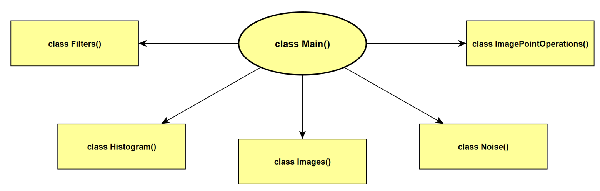

# Image Analysis Final Project
This repo contains all source code for the CMSC630 final project.

Development was done in Visual Studio Code with Python version 3.10.0.

Testing was done on a Windows 11 based Dell XPS 15 with an 11th Gen Intel(R) Core(TM) i7-11800H @ 2.30GHz 16 core processor and 32 GB of RAM.

## :card_index_dividers: Files
- *src*: Folder containing all source code for the project.
- *src/.env*: The environment file which can be altered for running the code in various setup configurations.
- *src/main.py*: File containing the composite class which is made up of all component classes.
- *src/components*: Folder containing all component classes.
- *src/components/filters.py*: File containing the component class responsible for creating and maintaining the various imaging filters defined in the .env file.
- *src/components/histogram.py*: File containing the component class responsible for all histogram based operations.
- *src/components/images.py*: File containing the component class responsible for loading/saving and converting images into other types.
- *src/components/noise.py*: File containing the component class responsible for all noise based operations such as adding salt and pepper or gaussian noise to an image.
- *src/components/point_operations.py*: File containing the component class responsible for all point operations which can be performed on an image.
- *cell_images_original*: Folder containing the images on which this framework was tested. The image path from which images can be loaded is defined in the .env file.
- *requirements.txt*: Additional Python libraries required to run the project.

## :nut_and_bolt: Dealing With The Code

The <a href="src/.env">*environment file*</a> file should be used for defining your setup.

The composite *class Main()* located in <a href="src/main.py">*main.py*</a> instantiates all component classes and contains the main method required for the processing of images. 

To run the code:

    python <path-to-src-folder>/main.py

## :speech_balloon:	Questions?

Please address any inquiries to:
- hollingsworre@vcu.edu
